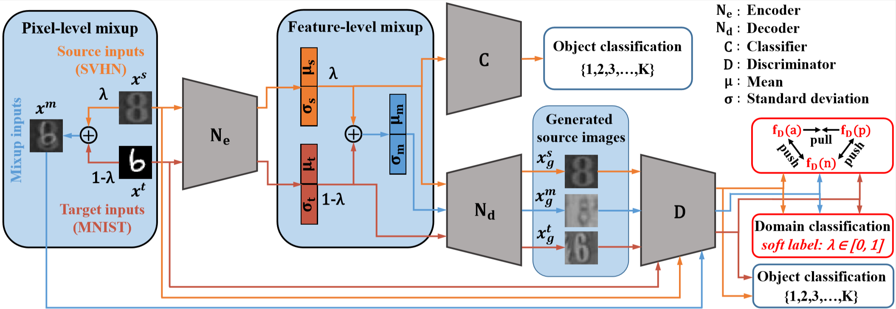
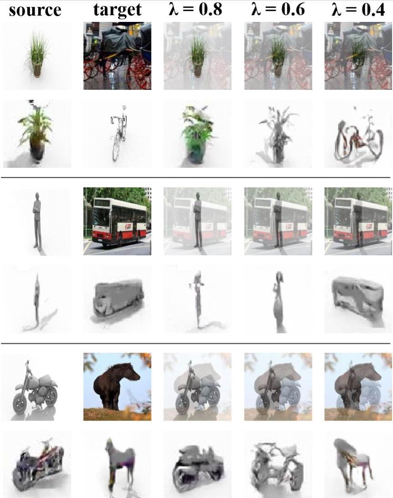

# Adversarial Domain Adaptation with Domain Mixup

<p align="center">
   
</p>

<br>

This is the implementation of Adversarial Domain Adaptation with Domain Mixup in PyTorch. This work is accepted as Oral presentation at AAAI 2020.

#### Adversarial Domain Adaptation with Domain Mixup: [[Paper (arxiv)]](https://arxiv.org/abs/1912.01805).
<br>

## Getting Started

* We combine Domain Mixup strategy with a classical adversarial domain adaptation method, [RevGrad](https://arxiv.org/abs/1409.7495v2), to showcase its effectiveness on boosting feature alignment. Details are presented in the [Mixup_RevGrad](https://github.com/ChrisAllenMing/Mixup_for_UDA/tree/master/Mixup_RevGrad) folder.
* The proposed DM-ADA approach utilizes a VAE-GAN based framework and performs Domain Mixup on both pixel and feature level. Details are presented in the [DM-ADA](https://github.com/ChrisAllenMing/Mixup_for_UDA/tree/master/DM-ADA) folder. Some typical generations from source, target and mixup features are as follows (VisDA-2017 dataset is employed).

<p align="center">
  
</p>

## Citation

If this work helps your research, please cite the following paper.
```
@inproceedings{xu2020adversarial,
  author    = {Minghao Xu and Jian Zhang and Bingbing Ni and Teng Li and Chengjie Wang and Qi Tian and Wenjun Zhang},
  title     = {Adversarial Domain Adaptation with Domain Mixup},
  booktitle = {The Thirty-Fourth {AAAI} Conference on Artificial Intelligence},
  pages     = {6502--6509},
  publisher = {{AAAI} Press},
  year      = {2020}
}
```